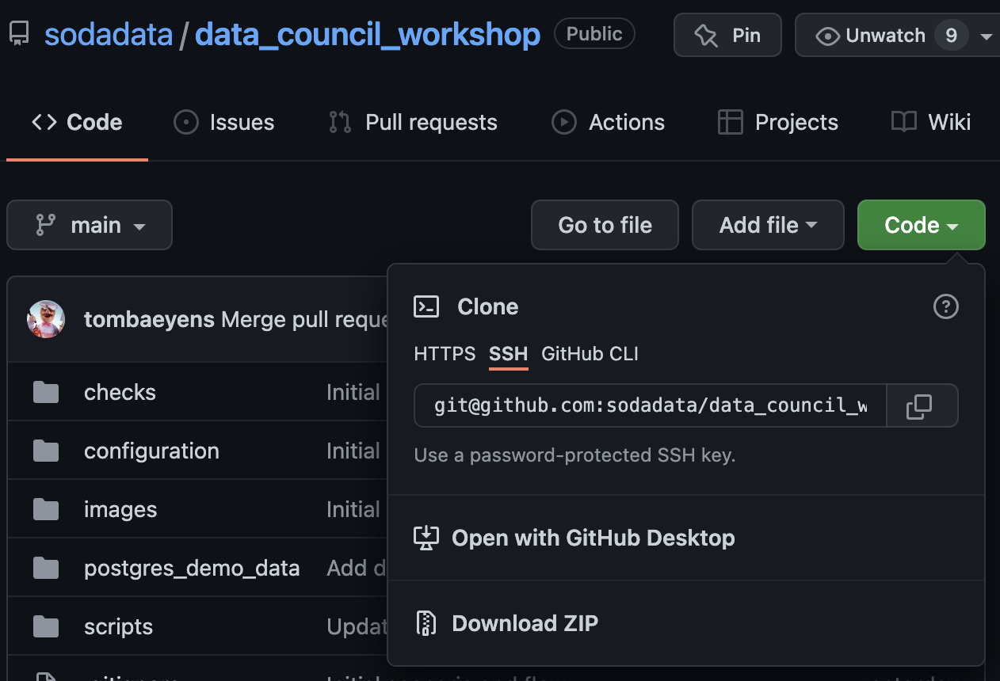
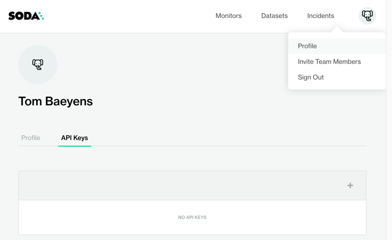
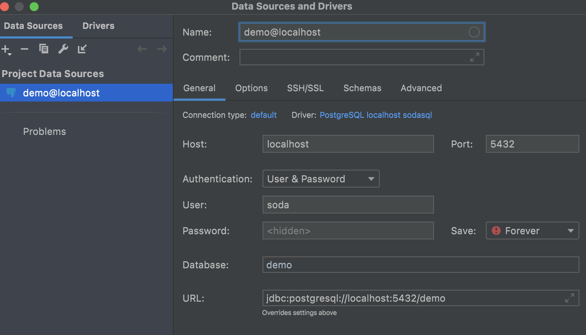

# Data Council Workshop

## Prerequisites

* Python 3.8+
* Docker

## Get this repository

Navigate to [https://go.soda.io/dcw](https://github.com/sodadata/data-council-workshop)

Clone the repository with git or download the zip file. 



## Asking for help

To get assistence during the workshop, ask on the Soda Community Slack.

Register for the community Slack: [https://go.soda.io/slack](https://go.soda.io/slack)

And use [the data-council-workshop channel](https://soda-community.slack.com/archives/C0378BFA2P9)

## The Soda Core documentation

In [the Soda Core documentation](https://docs.soda.io/soda-core/overview.html), you can find all information on how to get the CLI or library installed
and how to use the open source project.

## Installing the Soda CLI

Run convenience script `scripts/create_venv.sh`  
Or run these commands individually:

```shell
rm -rf .venv
python3 -m venv .venv
source .venv/bin/activate
pip install --upgrade pip
# pip install soda-core-postgres
```

You should see output like
```
TODO
```

## Running the demo data docker container

Run convenience script `scripts/start_postgres.sh`
Or run these commands individually:

```shell
cd postgres_demo_data
docker-compose up
```
You should see output like

```
[data-council-workshop] scripts/02_start_postgres.sh 
Starting postgres_demo_data_soda-sql-postgres_1 ... done
Attaching to postgres_demo_data_soda-sql-postgres_1
soda-sql-postgres_1  | ********************************************************************************
soda-sql-postgres_1  | WARNING: POSTGRES_HOST_AUTH_METHOD has been set to "trust". This will allow
soda-sql-postgres_1  |          anyone with access to the Postgres port to access your database without
soda-sql-postgres_1  |          a password, even if POSTGRES_PASSWORD is set. See PostgreSQL
...
soda-sql-postgres_1  | waiting for server to start....LOG:  database system was shut down at 2022-03-19 09:35:46 UTC
soda-sql-postgres_1  | LOG:  MultiXact member wraparound protections are now enabled
soda-sql-postgres_1  | LOG:  database system is ready to accept connections
soda-sql-postgres_1  | LOG:  autovacuum launcher started
```

Now you have a postgres database/warehouse with the demo data preloaded.

[View the demo data on page postgres_demo_data/DATA.md](postgres_demo_data/DATA.md) 

## Registering a Soda Cloud account

1. [Sign up for a Soda Cloud account](https://cloud.soda.io/signup)

2. Open `configuration/configuration.yml` in your favorite text editor

3. Create the API key.  In your Soda Cloud account, navigate to your avatar > Profile > API Keys, then click the plus icon to generate new API keys.



4. Copy the API Key ID, then paste it into the configuration.yml as the value for api_key.

5. Copy the API Key Secret, then paste it into the configuration.yml as the value for api_secret.

6. Save the changes to the configuration.yml file. Close the Create API Key dialog box in Soda Cloud.

## The SodaCL documentation

In the next section you'll be executing and exploring SodaCL YAML files. 

Check out [the SodaCL documentation](https://docs.soda.io/soda-cl/row-count.html), 
where you will find all information on how to write checks

## Running the checks

Review the SodaCL file `checks/01_basic_checks.yml` in your text/YAML editor.   

Run SodaCL file `checks/01_basic_checks.yml` 
```shell
soda scan -c configuration/configuration.yml -d workshop_ds checks/01_basic_checks.yml
```

Feel free to try and make some changes.  You can refer to 
[the SodaCL documentation](https://docs.soda.io/soda-cl/row-count.html) 
to see the possibilities.  Try to make some updates and re-run the scan.

If you encounter issues:

Ask the community on [Slack](https://go.soda.io/slack).  Our experts will be monitoring the channel extra closely during the workshop.

Run SodaCL file `checks/02_advanced_and_cool.yml` 
```shell
soda scan -c configuration/configuration.yml -d workshop_ds checks/02_advanced_and_cool.yml
```

Finally, review the analyst use cases

Run SodaCL file `checks/03_analyst_use_cases.yml` 
```shell
soda scan -c configuration/configuration.yml -d workshop_ds checks/03_analyst_use_cases.yml
```

## Feedback

As this is the initial public release of our new SodaCL language, we want to hear 
what you think.  Please give us your feedback on the 

Or log [a new issue in our GitHub repo](https://github.com/sodadata/soda-core/issues/new)

Next, proceed to the more advanced and cool checks


## Configuring the database in IntelliJ or Pycharm

This section is optional and only needed when you want to connect your PyCharm or 
IntelliJ to the Postgres DB containing the demo data.  Feel free to use any other 
DB browser of your choice.

Host: `localhost`
Port: `5432`
Database: `demo`
Username: `soda`
Password not necessary

Or

URL: `jdbc:postgresql://localhost:5432/demo`


