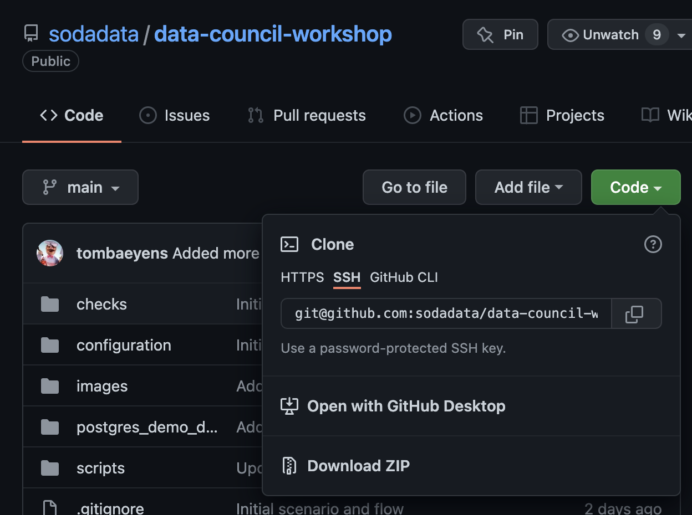

# Data Council Workshop

## Prerequisites

* Python 3.8+
* Docker

## Asking for help

To get assistence during the workshop, ask on the Soda Community Slack.

Register for the community Slack: [https://go.soda.io/slack](https://go.soda.io/slack)

And use [the data-council-workshop channel](https://soda-community.slack.com/archives/C0378BFA2P9)

## The Soda Core documentation

In [the Soda Core documentation](https://docs.soda.io/soda-core/overview.html), you can find all information on how to get the CLI or library installed
and how to use the open source project.

## Get this repository

Clone the repository with git or download the zip file from this page. 



## Running the demo data docker container

Before installing the Soda CLI, we will first launch the demo data docker container.
It's a single docker container that starts a Postgres database with the demo data 
preloaded on it.  

Run convenience script `scripts/start_postgres.sh`
Or run these commands individually:

```shell
cd postgres_demo_data
docker-compose up
```
You should see output like

```
[data-council-workshop] scripts/02_start_postgres.sh 
Starting postgres_demo_data_soda-sql-postgres_1 ... done
Attaching to postgres_demo_data_soda-sql-postgres_1
soda-sql-postgres_1  | ********************************************************************************
soda-sql-postgres_1  | WARNING: POSTGRES_HOST_AUTH_METHOD has been set to "trust". This will allow
soda-sql-postgres_1  |          anyone with access to the Postgres port to access your database without
soda-sql-postgres_1  |          a password, even if POSTGRES_PASSWORD is set. See PostgreSQL
...
soda-sql-postgres_1  | waiting for server to start....LOG:  database system was shut down at 2022-03-19 09:35:46 UTC
soda-sql-postgres_1  | LOG:  MultiXact member wraparound protections are now enabled
soda-sql-postgres_1  | LOG:  database system is ready to accept connections
soda-sql-postgres_1  | LOG:  autovacuum launcher started
```

Now you have a postgres database/warehouse with the demo data preloaded.

[View the demo data on page postgres_demo_data/DATA.md](postgres_demo_data/DATA.md) 

Now you will have to leave this console open until you want to stop the Postgres demo data docker 
container.  

To stop the container (at the end of the workshop), simply press `CTRL+C`.

## Installing the Soda CLI

To continue the workshop, start a new console because the postgres container is blocking 
the command line. 

After you cloned / unzipped the repository, navigate to the `data-council-workshop` folder.
```shell
cd data-council-workshop
```

To check if you're in the right folder, `ls` should look like this
```shell
[data-council-workshop] ls 
LICENSE			checks			images			scripts
README.md		configuration		postgres_demo_data
```

Run convenience script `scripts/create_venv.sh`  
Or run these commands individually:

```shell
rm -rf .venv
python3 -m venv .venv
source .venv/bin/activate
pip install --upgrade pip
pip install soda-core-postgres
```

You should see output like
```
[data-council-workshop] rm -rf .venv
[data-council-workshop] python3 -m venv .venv
[data-council-workshop] source .venv/bin/activate
(.venv) [data-council-workshop] pip install --upgrade pip
Requirement already satisfied: pip in ./.venv/lib/python3.8/site-packages (21.1.1)
Collecting pip
  Using cached pip-22.0.4-py3-none-any.whl (2.1 MB)
Installing collected packages: pip
  Attempting uninstall: pip
    Found existing installation: pip 21.1.1
    Uninstalling pip-21.1.1:
      Successfully uninstalled pip-21.1.1
Successfully installed pip-22.0.4
(.venv) [data-council-workshop] 
(.venv) [data-council-workshop] pip install --upgrade pip
Requirement already satisfied: pip in ./.venv/lib/python3.8/site-packages (21.1.1)
Collecting pip
  Using cached pip-22.0.4-py3-none-any.whl (2.1 MB)
Installing collected packages: pip
  Attempting uninstall: pip
    Found existing installation: pip 21.1.1
    Uninstalling pip-21.1.1:
      Successfully uninstalled pip-21.1.1
Successfully installed pip-22.0.4
(.venv) [data-council-workshop] pip install soda-core-postgres
Collecting soda-core-postgres
...
Successfully installed Deprecated-1.2.13 Jinja2-2.11.3 antlr4-python3-runtime-4.9.3 backoff-1.10.0 certifi-2021.10.8 charset-normalizer-2.0.12 click-8.0.4 googleapis-common-protos-1.56.0 idna-3.3 markupsafe-2.0.1 opentelemetry-api-1.10.0 opentelemetry-exporter-otlp-proto-http-1.10.0 opentelemetry-proto-1.10.0 opentelemetry-sdk-1.10.0 opentelemetry-semantic-conventions-0.29b0 protobuf-3.19.4 psycopg2-binary-2.9.3 requests-2.27.1 ruamel.yaml-0.17.21 ruamel.yaml.clib-0.2.6 soda-core-3.0.0b1 soda-core-postgres-3.0.0b1 typing-extensions-4.1.1 urllib3-1.26.9 wrapt-1.14.0
```

Now verify that the installation went ok by entering command `soda`:
```shell
(.venv) [data-council-workshop] soda
Usage: soda [OPTIONS] COMMAND [ARGS]...

  Soda Core CLI version 3.0.0b1

Options:
  --help  Show this message and exit.

Commands:
  scan    runs a scan
  update  updates a distribution reference file
```

## Registering a Soda Cloud account

1. [Sign up for a Soda Cloud account](https://cloud.soda.io/signup)

2. Open `configuration/configuration.yml` in your favorite text editor

3. Create the API key.  In your Soda Cloud account, navigate to your avatar > Profile > API Keys, then click the plus icon to generate new API keys.


4. Copy the API Key ID, then paste it into the configuration.yml as the value for api_key.

5. Copy the API Key Secret, then paste it into the configuration.yml as the value for api_secret.

6. Save the changes to the configuration.yml file. Close the Create API Key dialog box in Soda Cloud.

## The SodaCL documentation

In the next section you'll be executing and exploring SodaCL YAML files. 

Check out [the SodaCL documentation](https://docs.soda.io/soda-cl/soda-cl-overview.html), 
where you will find all information on how to write checks

## Running the checks

Review the SodaCL file `checks/01_basic_checks.yml` in your text/YAML editor.
If the checks in the file are not clear, ask us for help.

Run SodaCL file `checks/01_basic_checks.yml` 
```shell
soda scan -c configuration/configuration.yml -d workshop_ds checks/01_basic_checks.yml
```

Feel free to try and make some changes.  You can refer to 
[the SodaCL documentation](https://docs.soda.io/soda-cl/soda-cl-overview.html) 
to see the possibilities.  Try to make some updates and re-run the scan.

If you encounter issues:

Ask the community on [Slack](https://soda-community.slack.com/archives/C0378BFA2P9).  Our experts will be monitoring 
the data-council-workshop channel extra closely during the workshop.

Run SodaCL file `checks/02_advanced_and_cool.yml` 
```shell
soda scan -v "START=2022-02-24 00:00:00" -v "END=2022-02-25 00:00:00" -c configuration/configuration.yml -d workshop_ds checks/02_advanced_and_cool.yml
```

Finally, review the analyst use cases

Run SodaCL file `checks/03_analyst_use_cases.yml` 
```shell
soda scan -c configuration/configuration.yml -d workshop_ds checks/03_analyst_use_cases.yml
```

## Feedback

As this is the initial public release of our new SodaCL language, we want to hear 
what you think.   Here are some questions that might help formulate your feedback.

* Would you recommend Soda Core to a collegue?
  * Why or why not?
  * Do you think it's more relevant to others in your organization?  If so, who?
* What do you think is the most attractive feature?
* Any specific features missing?
* How would you compare SodaCL and Soda Core vs other open source data quality tools that you know?
* If you do not yet plan to use it right now, what is the most important blocker for you?

Let us know [the data-council-workshop channel](https://soda-community.slack.com/archives/C0378BFA2P9)

Or if you prefer, send your feedback as an email to [mailto:workshop@soda.io](workshop@soda.io)  

## Configuring the database in IntelliJ or Pycharm

This section is optional and only needed when you want to connect your PyCharm or 
IntelliJ to the Postgres DB containing the demo data.  Feel free to use any other 
DB browser of your choice.

Host: `localhost`
Port: `5432`
Database: `demo`
Username: `soda`
Password not necessary

Or

URL: `jdbc:postgresql://localhost:5432/demo`


